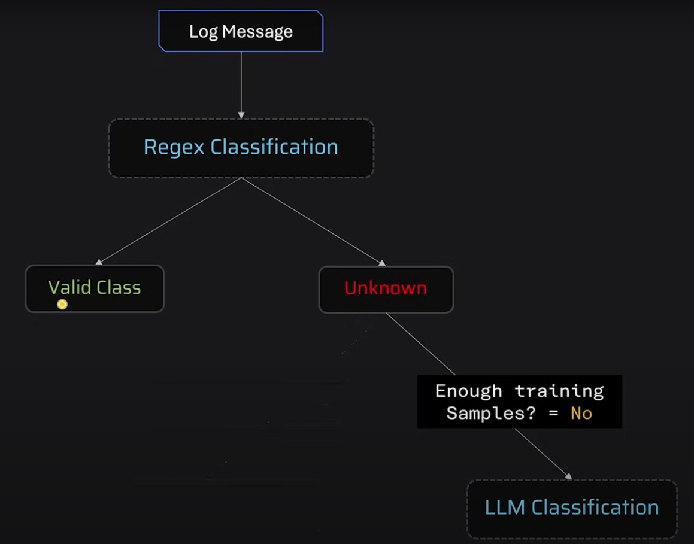
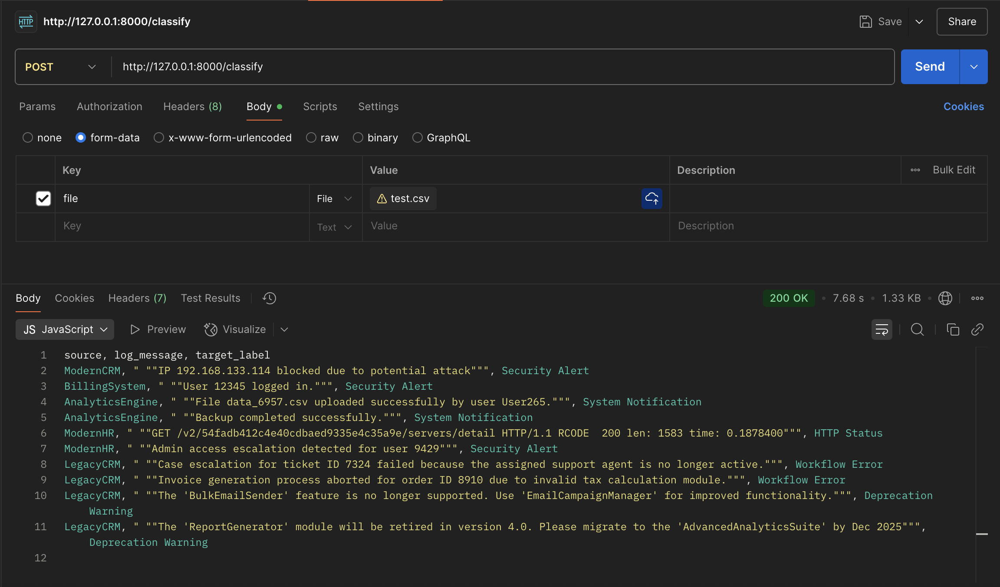

# 🚀 Log Classification With Hybrid Classification Framework

This project implements a **hybrid log classification system**, combining three complementary techniques to efficiently classify logs into functional categories. It is designed to support scalable, real-time **log monitoring systems** used by enterprises to detect issues early and improve operational reliability.

---

## 🎯 Project Purpose

In a typical company, software systems generate extensive log files. Traditionally, engineers must manually search through these logs to trace and fix issues — a process that could take hours. This project automates that with a hybrid model capable of intelligently categorizing logs, which can:

- Trigger alerts
- Improve security response time
- Enable smarter monitoring

---

## 🧠 Classification Approach

### 1. ✅ **Regex-Based Classification**

- Fast and deterministic
- Captures known, repetitive log patterns

### 2. 🤖 **BERT + Sentence Transformers**

- Used when regex fails
- Learns complex and semi-structured logs
- Uses embeddings + logistic regression

### 3. 💡 **LLM (via Groq)**

- Final fallback for unknown or irregular logs
- Uses a lightweight LLM API to interpret logs contextually

### 🔁 **Hybrid Benefits**

- Optimized compute cost
- Better accuracy
- Lower inference time
- Modular & scalable

---

## 🖼️ Architecture Overview



---

## 📁 Folder Structure of the project

```
.
├── training/         # Code for training BERT + Regex
├── models/           # Saved models (embeddings, .joblib files)
├── resources/        # CSV files (input/output), examples
├── assets/           # Diagrams and API output screenshot
├── server.py         # FastAPI server code
└── classifier.py     # Main classification logic
```

---

## ⚙️ Setup Instructions

### 1. Install Dependencies

```bash
python3 -m venv venv
source venv/bin/activate
pip install -r requirements.txt
```

### 2. Start the Server

```bash
uvicorn server:app --reload
```

### 3. Use the API

- Visit: `http://127.0.0.1:8000/docs`
- Or use Postman:
  - Endpoint: `http://127.0.0.1:8000/classify/`
  - Upload a `.csv` file with:
    - `source`
    - `log_message`

---

## 🧪 Sample API Output

Below is a snapshot of the API in action:



---

## 📝 Output Format

The response will be a `.csv` file with a new column:

- `target_label`: contains the predicted functional category for each log message

---

## 💼 Real-World Use Case

This API is **client-ready**, designed as a backend service to be integrated with enterprise log monitoring dashboards or alerting systems. It's built to scale as a microservice, similar to how large organizations like Splunk, Datadog, or SumoLogic manage logs.

---

## 📌 Key Takeaways

- Excel → embeddings → DBSCAN clustering → Regex
- Regex for known logs, BERT for hard cases, LLM for unknowns
- Models saved in `.joblib` format
- Uses **Groq** API for LLM
- Output = enhanced CSV with predictions
- Built using **FastAPI** for speed and simplicity

---
